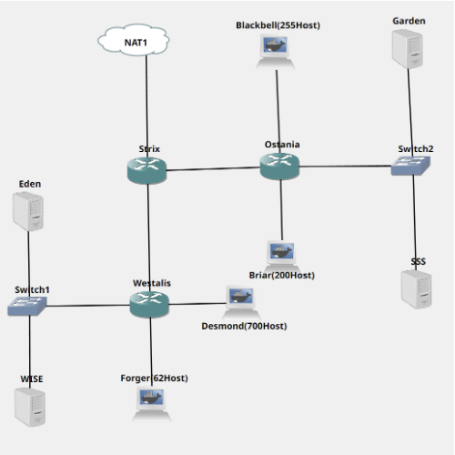
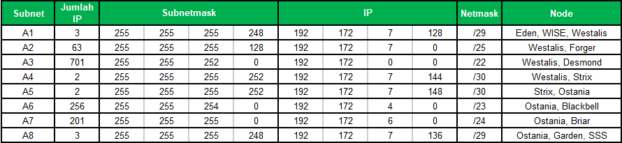

# Jarkom-Modul-5-A07-2022

## Anggota Kelompok

- I Putu Bagus Adhi Pradana (5025201010)
- Izzati Mukhammad (5025201075)
- Muhammad Damas Abhirama (5025201271)

## Tugas pertama kalian yaitu membuat topologi jaringan sesuai dengan rancangan yang diberikan Loid dibawah ini:

## Pembagian IP
Berikut merupakan pembagian IP

## Routing
- Strix

      auto eth0
      iface eth0 inet dhcp

      auto eth1
      iface eth1 inet static
              address 192.172.0.1
              netmask 255.255.255.252

      auto eth2
      iface eth2 inet static
               address 192.172.0.5
               netmask 255.255.255.252
               
- Westalis

      auto eth0
      iface eth0 inet static
              address 192.172.0.2
              netmask 255.255.255.252
              gateway 192.172.0.1

      auto eth1
      iface eth1 inet static
              address 192.172.0.17
              netmask 255.255.255.248

      auto eth2
      iface eth2 inet static
               address 192.172.0.129
               netmask 255.255.255.128

      auto eth3
      iface eth3 inet static
               address 192.172.4.1
               netmask 255.255.252.0

- Ostania

      auto eth0
      iface eth0 inet static
                address 192.172.0.6
                netmask 255.255.255.252
                gateway 192.172.0.5

      auto eth1
      iface eth1 inet static
                address 192.172.0.25
                netmask 255.255.255.248

      auto eth2
      iface eth2 inet static
                address 192.172.2.1
                netmask 255.255.254.0

      auto eth3
      iface eth3 inet static
                address 192.172.1.1
                netmask 255.255.255.0

- Eden

      auto eth0
      iface eth0 inet static
            address 192.172.0.130
            netmask 255.255.255.128
            gateway 192.172.0.129
            
- WISE

      auto eth0
      iface eth0 inet static
              address 192.172.0.19
              netmask 255.255.255.248
              gateway 192.172.0.17

- Garden

      auto eth0
      iface eth0 inet static
                address 192.172.0.26
                netmask 255.255.255.248
                gateway 192.172.0.25

- SSS

      auto eth0
      iface eth0 inet static
                address 192.172.0.27
                netmask 255.255.255.248
                gateway 192.172.0.25

- Blackbell, Forger, Desmond, Briar

      auto eth0
      iface eth0 inet dhcp
      
## Anya, putri pertama Loid, juga berpesan kepada anda agar melakukan Routing agar setiap perangkat pada jaringan tersebut dapat terhubung.
- Strix

      route add -net 192.172.1.0 netmask 255.255.255.0 gw 192.172.0.6                                     
      route add -net 192.172.2.0 netmask 255.255.254.0 gw 192.172.0.6                                   
      route add -net 192.172.0.24 netmask 255.255.255.248 gw 192.172.0.6                                    
      route add -net 192.172.4.0 netmask 255.255.252.0 gw 192.172.0.2                                         
      route add -net 192.172.0.128 netmask 255.255.255.128 gw 192.172.0.2                                 
      route add -net 192.172.0.16 netmask 255.255.255.248 gw 192.172.0.2 

- Westalis

      route add -net 0.0.0.0 netmask 0.0.0.0 gw 192.172.0.1

- Ostania

      route add -net 0.0.0.0 netmask 0.0.0.0 gw 192.172.0.5
